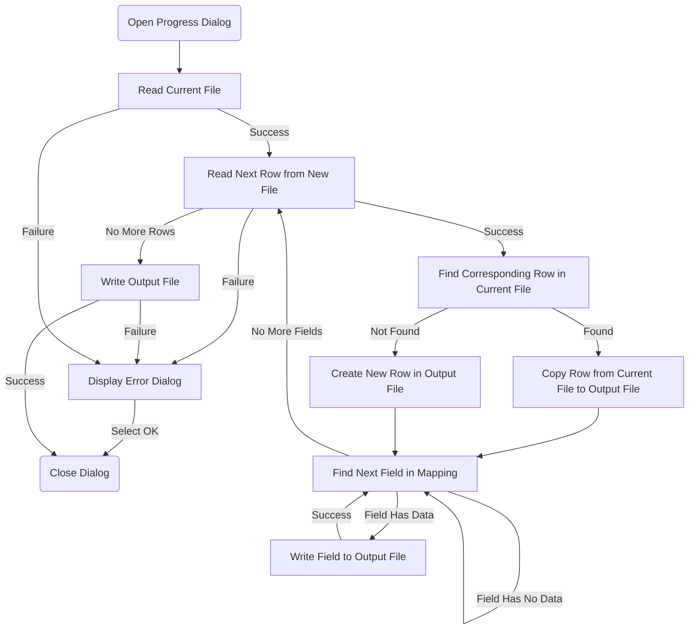

```mermaid
graph TD
    A(Open Progress Dialog) --> B[Read Current File]
    Z -->|Select OK| Y(Close Dialog)
    G -->|Success| Y
    B -->|Success| C[Read Next Row from New File]
    C -->|Success| D[Find Corresponding Row in Current File]
    D -->|Found| I[Copy Row from Current File to Output File]
    I --> E[Find Next Field in Mapping]
    F -->|Success| E
    D -->|Not Found| H[Create New Row in Output File]
    H --> E
    E -->|Field Has Data| F[Write Field to Output File]
    E -->|Field Has No Data| E
    E -->|No More Fields| C
    C -->|Failure| Z
    G -->|Failure| Z[Display Error Dialog]
    B -->|Failure| Z[Display Error Dialog]
    C -->|No More Rows| G[Write Output File]
```

