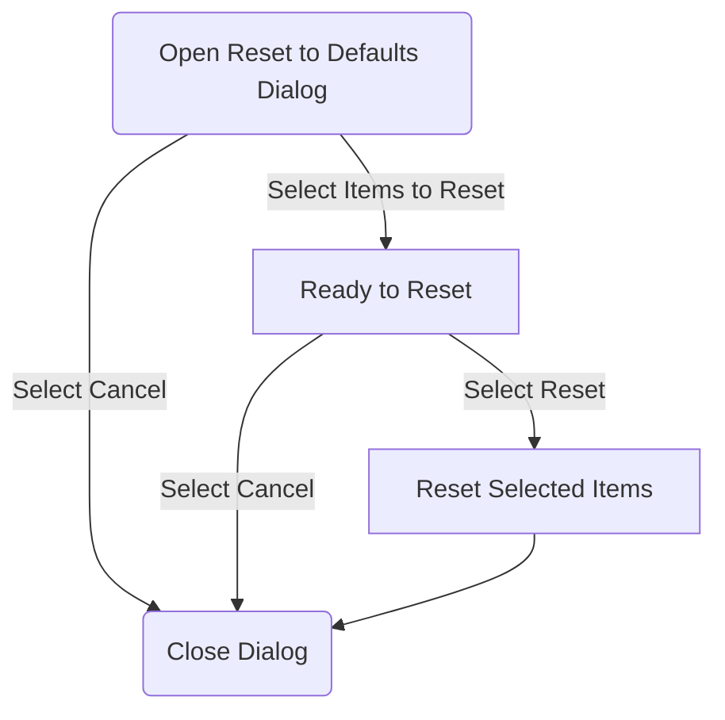

## Reset to Defaults

```mermaid
flowchart TD
    A(Open Reset to Defaults Dialog) -->|Select Items to Reset| B[Ready to Reset]
    B -->|Select Reset| C[Reset Selected Items]
    A -->|Select Cancel| D(Close Dialog)
    B -->|Select Cancel| D(Close Dialog)
    C --> D(Close Dialog)
```

