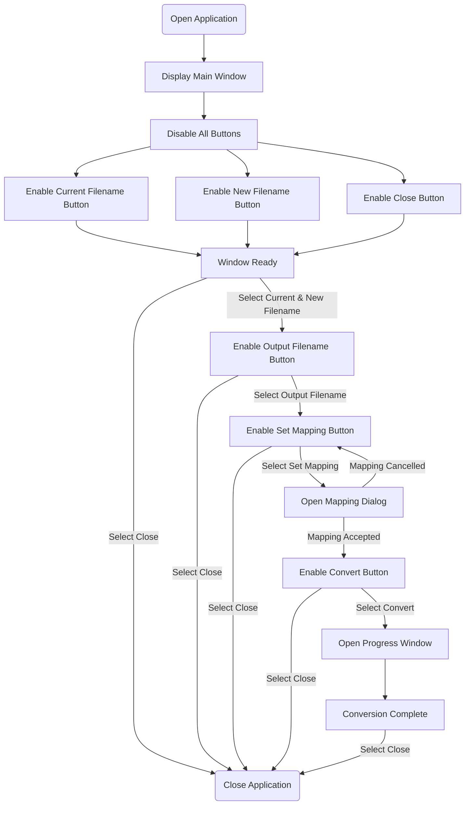

## Main Window Workflow

```mermaid
flowchart TD
    A(Open Application) --> B[Display Main Window]
    B --> C[Disable All Buttons]
    C --> D[Enable Current Filename Button]
    C --> E[Enable New Filename Button]
    C --> F[Enable Close Button]
    D --> G[Window Ready]
    E --> G
    F --> G
    G -->|Select Current & New Filename| H[Enable Output Filename Button]
    H -->|Select Output Filename| I[Enable Set Mapping Button]
    I -->|Select Set Mapping| J[Open Mapping Dialog]
    J -->|Mapping Cancelled| I
    J -->|Mapping Accepted| K[Enable Convert Button]
    K -->|Select Convert| L[Open Progress Window]
    L --> M[Conversion Complete]
    G -->|Select Close| N(Close Application)
    H -->|Select Close| N(Close Application)
    I -->|Select Close| N(Close Application)
    K -->|Select Close| N(Close Application)
    M -->|Select Close| N(Close Application)
```
