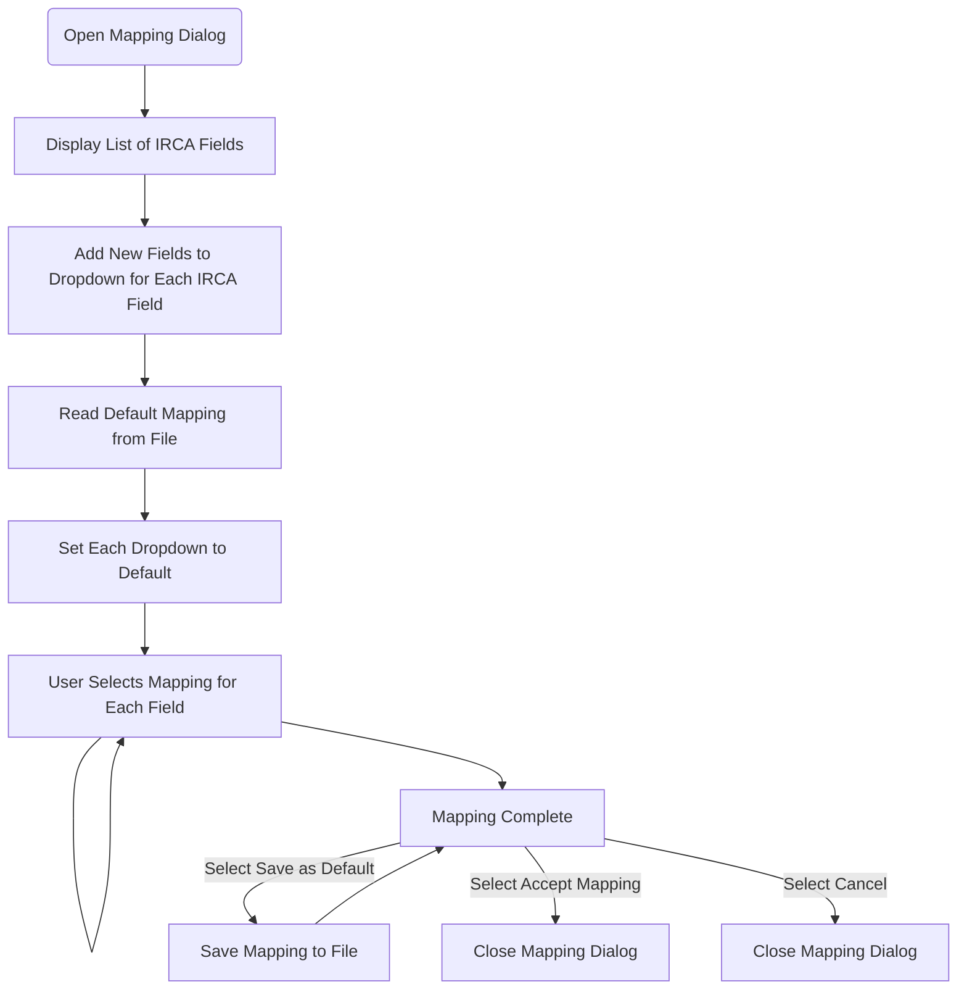

## Flowchart

```mermaid
flowchart TD
    A(Open Mapping Dialog) --> B[Display List of IRCA Fields]
    B --> C[Add New Fields to Dropdown for Each IRCA Field]
    C --> D[Read Default Mapping from File]
    D --> E[Set Each Dropdown to Default]
    E --> F[User Selects Mapping for Each Field]
    F --> F
    F --> G[Mapping Complete]
    G -->|Select Save as Default| H[Save Mapping to File]
    H --> G
    G -->|Select Accept Mapping| I[Close Mapping Dialog]
    G -->|Select Cancel| J[Close Mapping Dialog]
```
